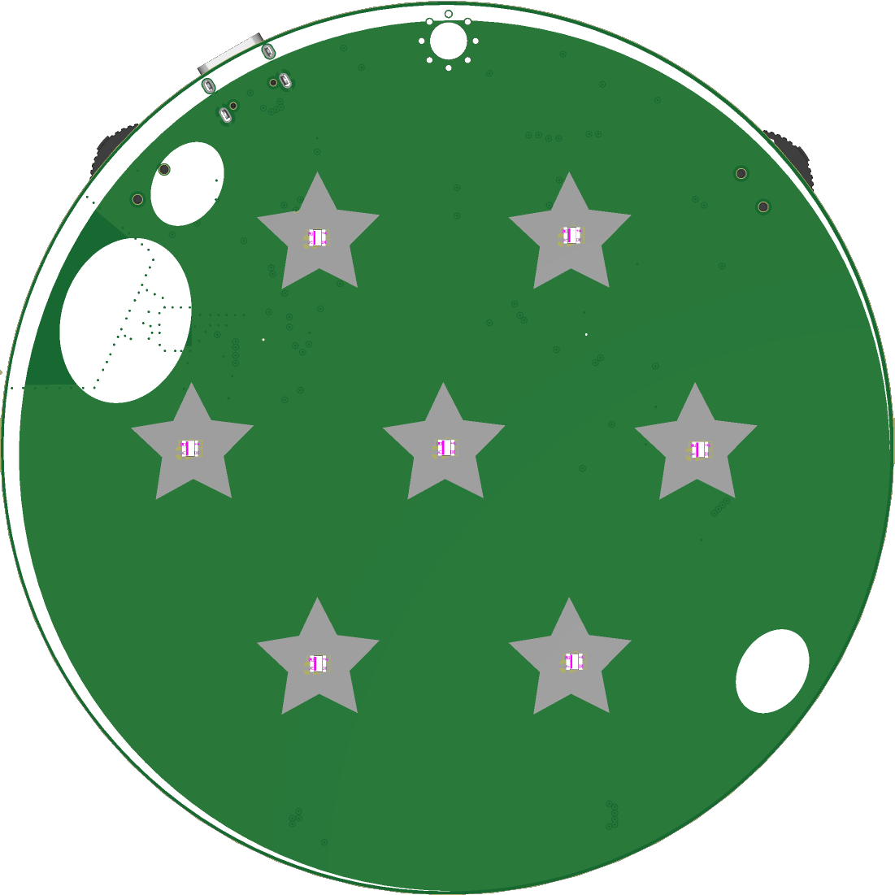
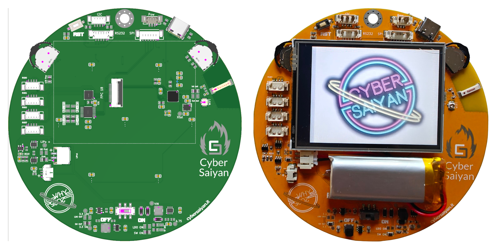
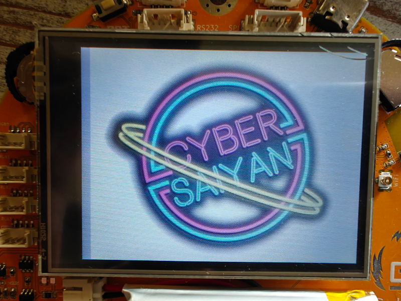
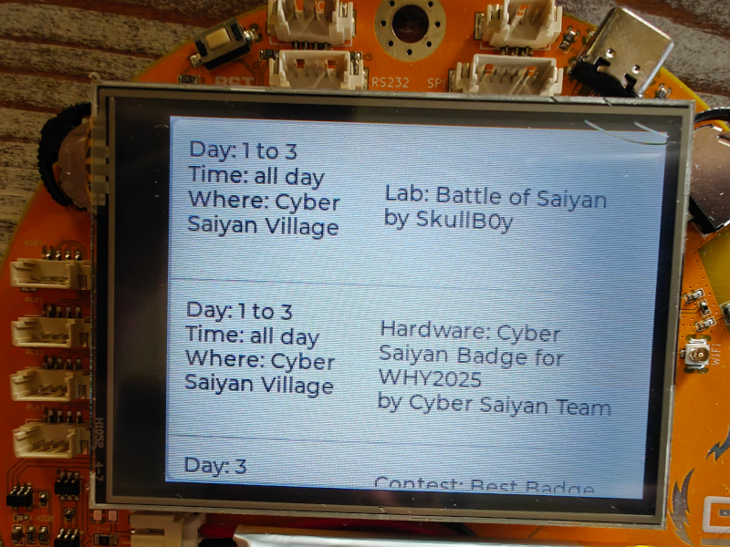
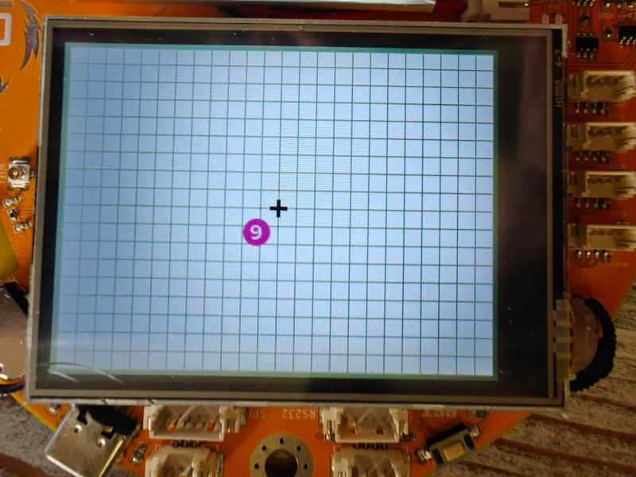
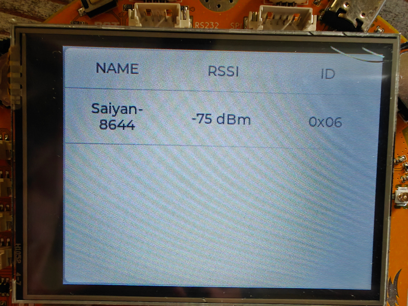
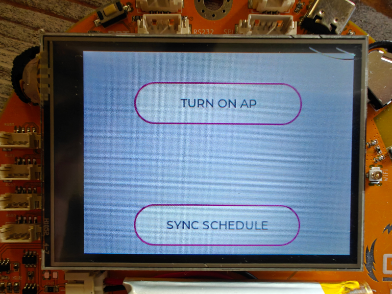
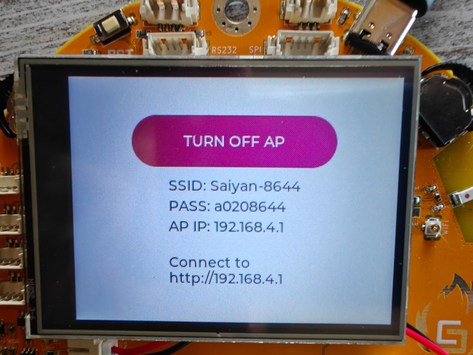
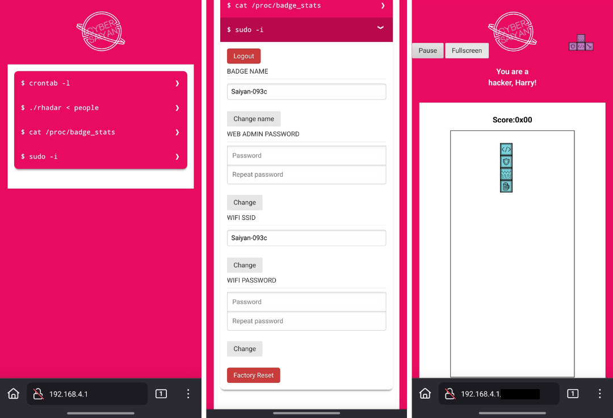
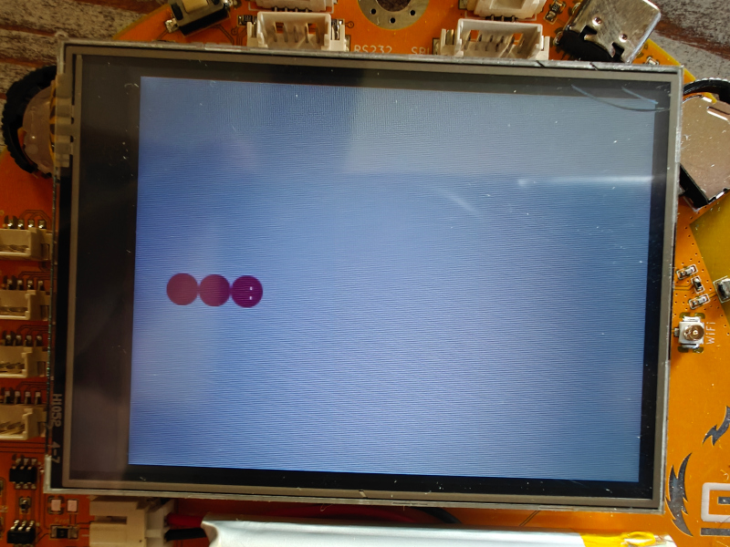

# WHY2025 Badge

The Cyber Saiyan community designed and developed a special gadget to celebrate [WHY2025](https://www.cybersaiyan.it/why2025/)... You can get one of the 200 available badges at the [Cyber Saiyan Village](https://wiki.why2025.org/Village:Cyber_Saiyan) and start playing.

## Useful information:

* To play with and hack the badge, we recommend bringing a **USB Type‑C data cable**
* The badge is already flashed with the WHY2025 specific firmware
* We would greatly appreciate any improvements to the project and pull requests.
* Don't hesitate to come and visit us at the Cyber Saiyan Village if you need help
* **Bonus**: on [Day 2, Aug 9, 2025 at 16:00 in Cassiopeia](https://cfp.why2025.org/why2025/talk/3CSQRF/) we present the hardware design and the firmware during the talk "Summoning Shenron: Building the Cyber Saiyan Badge"

## Features

The badge has several simple features to enhance your Village experience:
* It is designed to recall the dragon spheres (maybe you will be able to summon Shenron...)
* The core is a low-power **ESP32-C3** SoC
   * Integrates a 32-bit single-core RISC-V microcontroller with a maximum clock speed of 160 MHz
   * 400 KB of internal RAM and 4MB flash
   * Wi-Fi and Bluetooth 5 (LE)
   * 16 programmable GPIOs
* In the front there are 7 RGB leds
* In the back you have  
   * A 2.8'' TFT screen 
   * A LiPo battery, connectors and power switch
   * A reset button
   * 2 Dial Wheel Switch
   * 8 connectors for configurable GPIOs and expansions

## Interaction

Once powered on, the badge is assigned an ID from 1 to 7 and begins advertising itself via BLE.

**Change Screens**: **Long-press** (at least 1 second) either Dial Wheel Switch.

You can interact with the screen by short pressing (up or down) one of the two Dial Wheel Switch.

## Screens

### First screen

The Cyber Saiyan WHY2025 logo

### Second screen

The Cyber Saiyan Village schedule. Use the 5th screen to update it.

### Third Screen

The badge radar, showing nearby badges in a Dragon Ball style.

### Fourth screen

The badge's list, you can see all the badges around in a table view

### Fifth screen

The Wi-Fi functionalities

#### TURN ON AP

Start the AP mode (move up the Dial Wheel Switch) and connect from your PC/phone to the badge AP using SSID and PASS shown; after that you can navigate to `http://192.168.4.1` in order to explore more functionalities (hey Harry, can you play tetris?) and change configurations (`saiyan` is the pwd)

#### SYNC SCHEDULE

Start the SYNC mode (move down the Dial Wheel Switch) in order to update the Village schedule; the badge connects to WHY2025 open wi-fi to download the updated schedule from Cyber Saiyan website

### Sixt Screen
Have fun while playing Snake! 🐍

## Characteristics

The ESP32-C3 chip is the MCU at the core of the WHY2025 Badge, it integrates multiple peripherals to enable communication with the outside world.
The number of available pins is limited to keep the chip package size small. To route all the incoming and outgoing signals a set of software programmable registers controls the pin multiplexer.

### Peripheral Interfaces
There are 16 programmable GPIO pins available for:
* Digital interfaces
   * 3 SPI
   * 2 UART
   * I2C
   * I2S
   * Remote control peripheral, with 2 transmit channels and 2 receive channels
   * LED PWM controller, with up to 6 channels
   * Full-speed USB Serial/JTAG controller
   * General DMA controller (GDMA), with 3 transmit channels and 3 receive channels
   * TWAI® controller compatible with ISO 11898-1 (CAN Specification 2.0)
* Analog interfaces
   * 2 SAR ADCs (12-bit), up to 6 channels
   * Temperature sensor

### Devices on board
The WHY2025 Badge is equipped with a 2.8 inch TFT color LCD screen with 240 x 320 pixels, using the [ST7789](hardware/datasheet/ST7789V.pdf) display controller.
This display integrates a resistive touchscreen a white LEDs backlight and features an 18-pin standard FPC cable to interface the MCU with a 4-wire SPI bus.
___
The SPI bus signals are available on the connector labeled "SPI" at the top of the badge:
| pin  | function |
| :--- | :------: |
| 1    |   GND    |
| 2    |   MOSI   |
| 3    |    CS    |
| 4    |    DC    |
| 5    |   CLK    |
| 6    |   MISO   |

___
The current firmware version does not support touchscreen functionality, but the Badge still features the [TSC2007](hardware/datasheet/tsc2007.pdf) I2C Resistive Touch Screen Controller.

The front RGB LEDs are intelligent, individually addressable [WS2812B](hardware/datasheet/WS2812B.pdf) chips that communicate with each other and the microcontroller via a single data line. The data transfer protocol uses a single NZR communication mode. The signal from the DOUT port of the last LED on the badge is available on the "1W" pin of the connector, labeled "I2C."
___
The I2C bus signals are available on the connector labeled "I2C" at the top of the badge:
| pin  | function |
| :--- | :------: |
| 1    |   GND    |
| 2    |   SCL    |
| 3    |   SDA    |
| 4    |    1W    |
___
The display backlight is controlled by 4 pins on the [AW9523B](hardware/datasheet/AW9523.pdf) LED driver and GPIO controller with I2C interface while the other 12 pins on the I/O ports can be configured as LED drive mode or GPIO mode and are available on the connector labeled "RGB*".
___
The I/O signals from AW9523B are available on the connector labeled "RGB*" at the left of the badge:
| RGB0 | function |
| :--- | :------: |
| 1    |   GND    |
| 2    |   P0_0   |
| 3    |   P0_1   |
| 4    |   P0_2   |

| RGB1 | function |
| :--- | :------: |
| 1    |   GND    |
| 2    |   P0_3   |
| 3    |   P0_4   |
| 4    |   P0_5   |

| RGB2 | function |
| :--- | :------: |
| 1    |   GND    |
| 2    |   P0_6   |
| 3    |   P0_7   |
| 4    |   P1_4   |

| RGB3 | function |
| :--- | :------: |
| 1    |   GND    |
| 2    |   P1_5   |
| 3    |   P1_6   |
| 4    |   P1_7   |
___

The badge's main input interface consists of two **Dial Wheel Switches**. These switches can be rotated up or down for short and long presses to navigate and interact with the UI.
Pressing the center of the left switch results in the same effect as rotating the wheel UP, while pressing the center of the right switch results in the same effect as rotating the wheel DOWN.

Note: 
push the left switch (or rotating the wheel UP) during boot to put the MCU in Joint Download Boot mode to download binary files into flash using UART0 or USB interface. To reset/restart the MCU push the micro switch labeled "RST" on the top left of the badege.

During the boot process, the messages by the ROM code can be printed to (Default) UART0 and USB Serial/JTAG controller. 
___
The UART interface and the Strapping (button pin) signals are available on the connector labeled "RS232" at the top of the badge:
| pin  | function |
| :--- | :------: |
| 1    |   GND    |
| 2    |    TX    |
| 3    |    RX    |
| 4    | button B |
| 5    | button A |

___

The USB-C connector's D+/D- pins are connected to the default USB Serial/JTAG Controller and the USB power is routed to the LiPo battery charger and the voltage regulators.

There is the [MT3608](hardware/datasheet/MT3608B.pdf) step-up converter intended for power the WS2812 with up to 5V and the [MT3410LB](hardware/datasheet/MT3410LB-N.pdf) step-down DC-DC 3.3V regulator, capable of delivering up to 1.3A output current to the MCU and all the other IC.

In case of low power and low noise applications it's possible to disable the MT3410LB by removing two 0 ohm resistors labeled SW_ON/SW_OUT and enable the [RT9080](hardware/datasheet/RT9080-33.pdf) low-dropout (LDO) 3.3 voltage regulator by shorting two resistors pads labeled LDO_ON/LDO_OUT
___
The power lines are available on the connector labeled "POW" at the top of the badge:
| pin  | function |
| :--- | :------: |
| 1    |   GND    |
| 2    |  +3.3V   |
| 3    |  +4.75V  |
___

The battery is charged using a [TP4054](hardware/datasheet/TP4054.pdf) single-charge LiPo charger with a constant current/voltage algorithm and a [DW01](hardware/datasheet/dw01a.pdf) protection IC designed to protect the battery from damage due to over-discharge and/or over-current. The charging circuit and voltage regulators are always powered by the USB port. A toggle switch for turning the badge on and off via the battery is located on the bottom of the badge.

# Toolchain setup

## Prepare the environment 

### Visual Studio Code (VSCode)
Install Visual Studio Code as development environment:

* https://code.visualstudio.com/ - follow instructions there, if you don't have vscode yet.

### PlatformIO (PIO) extension
Install PlatformIO extension on Visual Studio Code:

* [Installation](http://docs.platformio.org/page/ide/vscode.html)
* [Quick Start](http://docs.platformio.org/page/ide/vscode.html#quick-start)
* [User Guide](http://docs.platformio.org/page/ide/vscode.html#user-guide)

Please follow to the official documentation [PlatformIO IDE for VSCode](http://docs.platformio.org/page/ide/vscode.html).

## Setup the project

* Git clone this repository and open it on VSCode

If you get a `No module named pkg_resources` error, open the PlatformIO Core CLI and run:
   * `pip install setuptools`

## Build www data (Linux)

* Prerequisites:
   * Install Node.js and NPM
* Use NPM to Install required Packages:
   * `npm install node-minify node-sass`

* `./www-build.sh`

## Build www data (Docker)

* Install docker
* `docker build --pull --rm -f "Dockerfile" -t why2025badge:latest "."`
* (Bash) `docker run -it -v $(pwd)/public:/public -v $(pwd)/data/www:/output why2025badge`
* (Powershell) `docker run -it -v ${PWD}/public:/public -v ${PWD}/data/www:/output why2025badge`
   
## Build/Upload Filesystem

In order to upload the filesystem to the badge you need to plugin the badge using USB.
In the "Project Tasks" view of PIO navigate to:

* `WHY2025-Bagde`
   * `Platform`
      * `Build Filesystem Image`
      * `Upload Filesystem Image`

## Build/Upload Firmware
In order to upload the firmware to the badge you need to plugin the badge using USB.
In the "Project Tasks" view of PIO navigate to:

* `WHY2025-Bagde`
   * `General`
      * `Build`
      * `Upload`

# Known Issues
* none (yet)

# Misc

## Wi-Fi SSID name lenght limit

The Wi-Fi SSID for connecting to an external Access Point (AP) is limited to **20 characters**.

## Use a different logo image

* Convert the BMP/JPG/PNG/SVG file to a C array. You can do this using an [online image converter](https://lvgl.io/tools/imageconverter): use LVGL v8, CF_TRUE_COLOR_ALPHA as color format and and C array as output
* adjust [main/badge/common/img_logo.c](main/badge/common/img_logo.c) file
